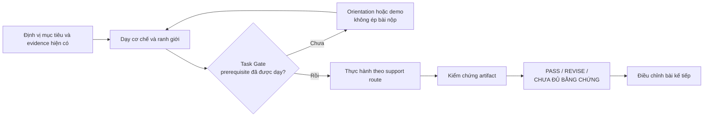

# Adaptive Learning

> An evidence-led learning skill for AI agents — teach the next real capability, then verify it with work that matters.

**Adaptive Learning Architect — Ms. Nguyen** biến một AI agent từ người trả lời nhanh thành người điều phối việc học có kỷ luật: dạy đúng năng lực kế tiếp, chỉ giao bài khi người học đã có nền cần thiết, và dùng artifact thay vì sự tự tin làm bằng chứng.

Nó được thiết kế cho các chủ đề khái niệm, lập trình, dữ liệu, khoa học thực nghiệm và thực hành phần mềm/AI tools.

## Vì sao skill này tồn tại

Một tutor AI rất dễ rơi vào ba lỗi quen thuộc:

1. Dùng cùng một kiểu tutorial hoặc quiz cho mọi lĩnh vực.
2. Giao bài tập đòi kiến thức chưa từng được dạy, rồi coi người học làm không được là thiếu năng lực.
3. Đánh giá “đã hiểu” dựa trên câu trả lời trôi chảy, thay vì code chạy được, quyết định có lý do, file render, phép tính hoặc nguồn kiểm chứng.

Adaptive Learning đặt một quy trình rõ ràng giữa việc dạy và việc kết luận.



## Những cam kết cốt lõi

| Thay vì | Adaptive Learning làm gì |
|---|---|
| Quiz trước khi dạy | Dạy prerequisite, cơ chế và điều kiện áp dụng trước khi yêu cầu output. |
| Ép mọi buổi có bài tập | Orientation có thể kết thúc sau một case hoặc trace; thực hành chỉ xuất hiện khi **Task Gate** đạt. |
| Chấm sự tự tin | Kiểm chứng artifact bằng công cụ hoặc nguồn phù hợp với domain. |
| Một giáo trình cứng cho mọi môn | Chọn route theo loại năng lực: khái niệm, kỹ thuật, định lượng, dữ liệu, tool, hệ thống, sáng tạo… |
| “Sai thì làm lại” mặc định | Nếu đề đòi prerequisite hoặc tiêu chí chưa dạy, ghi `TEACHING GAP`: sửa curriculum, không đổ lỗi cho learner. |
| Ghi toàn bộ trạng thái vào bài học | Tách bài học learner-facing khỏi learning map, rubric và evidence log nội bộ. |

## Bắt đầu nhanh

Repository này cung cấp skill ở đường dẫn:

```text
.agents/skills/adaptive-learning/
```

Trong một Codex workspace có skill này, gọi nó bằng ngôn ngữ tự nhiên hoặc prompt trực tiếp:

```text
$adaptive-learning dạy tôi GitHub theo trình độ hiện tại.
Tôi muốn hiểu pull request và thực hành an toàn trong một repository thật.
```

Hoặc với một công cụ:

```text
$adaptive-learning dạy tôi n8n theo một project nhỏ.
Ưu tiên mock data, không publish hay tiêu credits nếu tôi chưa cho phép.
```

Skill sẽ dùng evidence đang có để chọn điểm bắt đầu. Nếu context chưa đủ, nó thực hiện một placement ngắn hoặc dạy một orientation chung an toàn — không mặc định người học là beginner.

## Cách skill vận hành

### 1. Chọn năng lực, không chỉ chọn “môn học”

Mỗi module tập trung vào một năng lực khóa và outcome quan sát được. Ví dụ: *đọc một pull request để biết thay đổi gì*, không phải chỉ “học GitHub”; hoặc *debug một workflow chạy lỗi*, không phải chỉ “học n8n”.

### 2. Chọn độ sâu và mức hỗ trợ riêng rẽ

- **Depth:** `MICRO`, `STANDARD`, `DEEP` — lượng kiến thức cần xây.
- **Support route:** `COLD`, `SCAFFOLDED`, `REMEDIATION` — mức hỗ trợ phù hợp với evidence.

Hai quyết định này độc lập: một khái niệm có thể sâu nhưng vẫn cần cold attempt; một thao tác nhỏ có thể cần remediation nếu đã lộ lỗi gốc.

### 3. Chỉ kiểm tra khi Task Gate đạt

Trước mọi output của learner, agent phải xác định:

- output cần tạo là gì;
- prerequisite để tạo nó;
- prerequisite đó đã được dạy hoặc chứng minh ở đâu;
- đây có phải bước gần nhất của năng lực vừa xây không.

Nếu không trả lời được một trong bốn câu, không giao task và không chấm. Đây là cơ chế bảo vệ chống “bài tập vượt trình độ” — không phải một lớp thủ tục bắt người học phải quản lý.

### 4. Kiểm chứng đúng loại bằng chứng

| Domain | Ví dụ evidence phù hợp |
|---|---|
| Code/kỹ thuật | Code chạy, test, execution log, sửa một requirement mới |
| Định lượng/dữ liệu | Phép tính, bảng, query, chart và diễn giải giới hạn |
| Phần mềm/AI tool | Artifact, export, log hoặc thao tác quan sát được; không chỉ screenshot canvas |
| Khái niệm/hệ thống | Phân biệt case gần nhau, giải thích cơ chế trong biến thể mới, mô hình hoặc phản ví dụ |
| Sáng tạo | Artifact theo brief, critique và revision có lý do |

Kết quả chấm chỉ có bốn loại: `PASS`, `REVISE`, `CHƯA ĐỦ BẰNG CHỨNG`, hoặc `TEACHING GAP`.

## Cấu trúc skill

```text
.agents/skills/adaptive-learning/
├── SKILL.md                     # Điều phối workflow và các luật cốt lõi
├── agents/
│   └── openai.yaml              # Metadata giao diện
├── references/
│   ├── learning-kernel.md       # Chu trình dạy, support route và evidence
│   ├── domain-router.md         # Chọn phương pháp theo loại năng lực
│   ├── teacher-qa.md            # Task Gate, readiness và quality checks
│   ├── assessment-and-evidence.md
│   ├── placement-gate.md
│   └── ...
└── templates/
    ├── learning-map.md
    ├── learning-module.md
    ├── evidence-log.md
    ├── phase-challenge.md
    └── capstone.md
```

`SKILL.md` là entrypoint. Reference được đọc theo quyết định cần thực hiện, không nạp toàn bộ mỗi lượt. Template tạo artifact nhất quán mà không biến learner thành người quản trị hồ sơ học.

## Dữ liệu riêng tư và quyền thao tác

Skill là phần public. Course cá nhân, learner profile, learning map và evidence log là dữ liệu riêng của người học; chúng không thuộc release này và không nên đưa vào repository public.

Khi học công cụ, skill ưu tiên mock data, draft/test mode và artifact đảo ngược được. Nó không tự activate, publish, send, share, schedule hoặc tiêu credits có phí khi chưa có quyền rõ ràng.

## Giới hạn có chủ đích

- Không cấp danh xưng “master” hoặc “chuyên gia” từ một bài mô phỏng.
- Không giả vờ đã kiểm chứng giao diện, execution hay nguồn mà agent không quan sát được.
- Không thay thế lab, stakeholder, peer review hoặc production validation bằng lời khẳng định của AI.

## License

Phát hành theo [MIT License](LICENSE).
